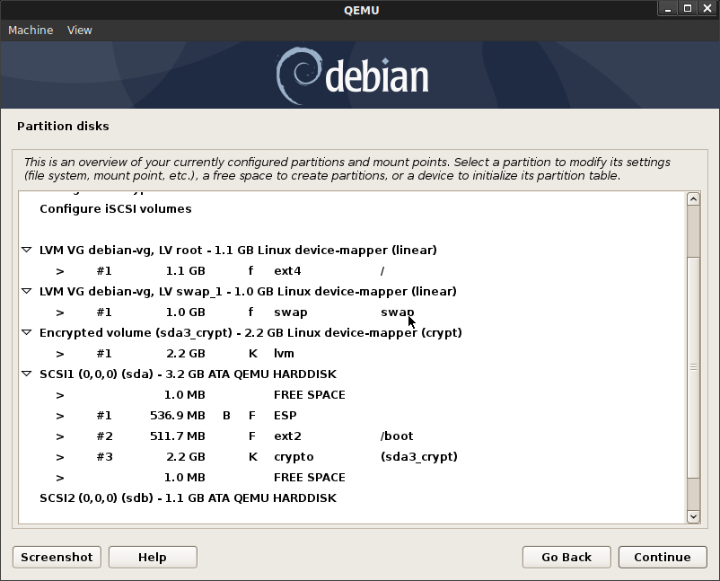
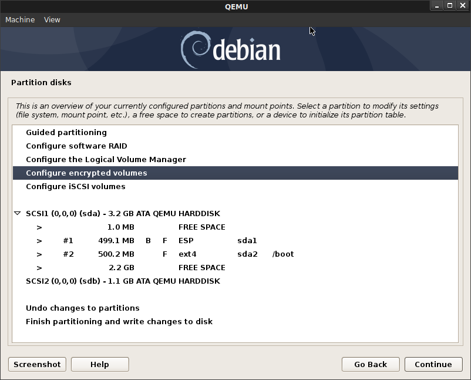
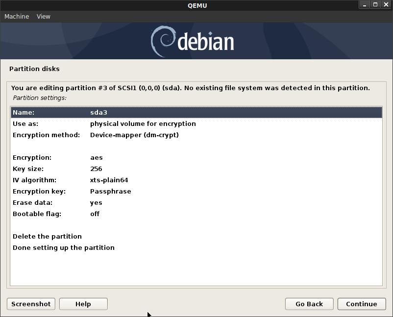
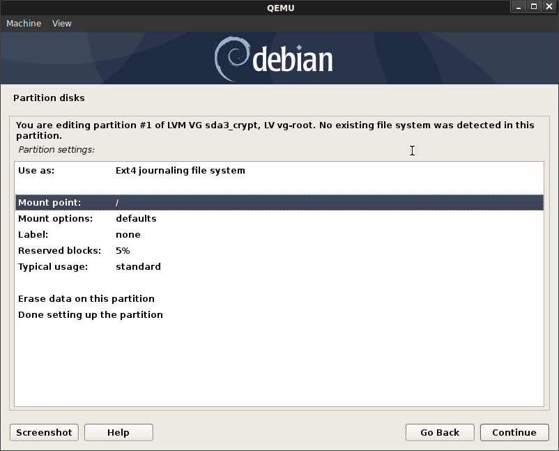
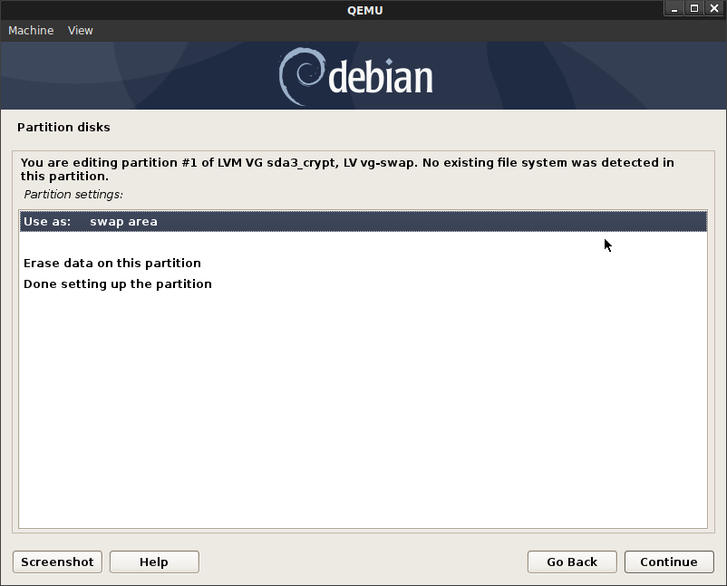
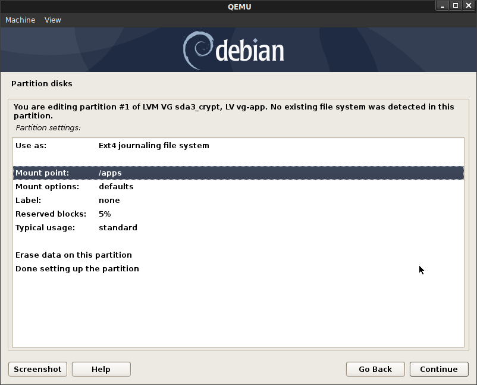
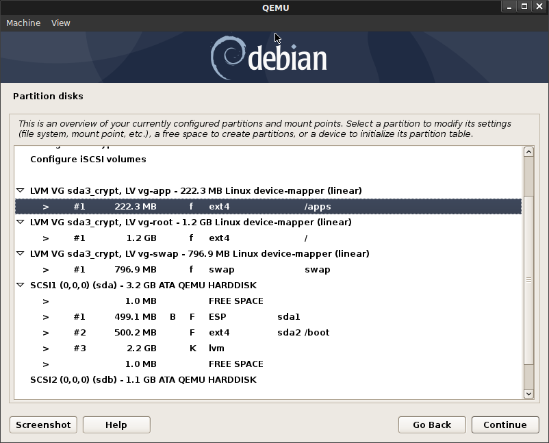
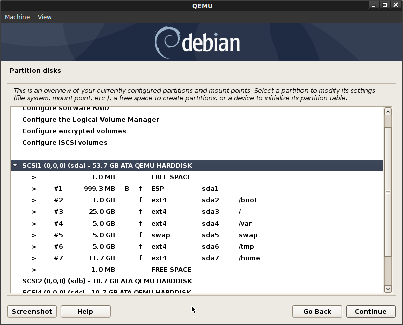
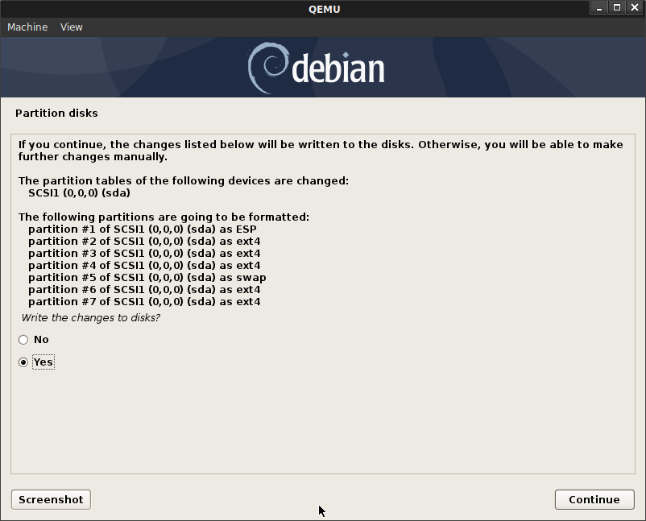

### Testing Secure Boot with qemu and debian 10.8.0

This repo is scratchpad for setting up and testing [SecureBoot VirtualMachine](https://wiki.debian.org/SecureBoot/VirtualMachine) with QEMU.  Its intended to just help get started with secure boot and is primarily just  here to log the steps i took locally.

The secure boot flow here will chain-verify signatures to ensure every step from the Firmware to the kernel is 'verified'.  You can read more about secure boot here:

- [Protecting your system from the scum of the universe](https://elinux.org/images/9/97/Protecting_your_system.pdf)
- [A Reasonably Secure Travel Laptop Setup](https://github.com/CrowdStrike/travel-laptop/blob/master/README.md)
- [Verified Boot](https://www.whonix.org/wiki/Verified_Boot)

This repo also contains some baseline samples of block encryption (`dm-crypt`), file/directory encryption (`fscrypt`) as well as integrity checking for a linux device (`dm-verity`).  

- [dm-crypt](https://en.wikipedia.org/wiki/Dm-crypt)
- [fscrypt](https://www.kernel.org/doc/html/v4.19/filesystems/fscrypt.html)
- [dm-verity](https://www.kernel.org/doc/html/latest/admin-guide/device-mapper/verity.html)
- [Setup dm-verity on a minimal Debian installation](https://www.chaplinspace.com/2020/Setup-dm-verity-on-a-minimal-debian-installation/)

For secure boot, this repo uses the signature and firmware thats already signed using microsoft's root CA that comes with the KVM firmware that we will download (i.e, it uses default Keys for debian standard).  Ultimately, i'll post instruction on how to create your own custom image using your on keys (which in real live hardware would mean you need to flash the firmware of your laptop with these keys...)


>> Please note that secure boot will only verify upto the boot; it will not verify the OS filesystem.  For that you can use `dm-verity` and include `intramfs` compiled into the kernel.  We are not covering that part in this repo;  think of this as a simple helloworld.

`dm-verity` is just shown standalone...i understand its really useful to verify the OS and 'applications' you run on the VM is in a state that you expect.  The real use is to verify the whole chain...this repo goes as far as the bootloader...the real use to verify the OS filesystem entirely (I.,e boot only if dm-verity passes on the core files of the OS).  but i haven't gotten that far.

I'll be using [KVM qemu](https://www.linux-kvm.org/page/RunningKVM) for this example


#### Get Debian 10.8 and  Firmware

Download [debian-10.8.0-amd64-netinst.iso](https://cdimage.debian.org/debian-cd/current/amd64/iso-cd/)

```bash
wget https://cdimage.debian.org/debian-cd/current-live/amd64/iso-hybrid/debian-live-10.8.0-amd64-standard.iso
```

```bash
mkdir debian_ovmf
cd debian_ovmf/
wget http://http.us.debian.org/debian/pool/main/e/edk2/ovmf_2020.11-2_all.deb
dpkg-deb -xv ovmf_2020.11-2_all.deb .
```

#### Create VM

We will be creating two disks:  `boot.img`, `disk1.img`, `disk2.img`.  The former contains the OS, boot, etc while the disk is used to demonstrate block and dm-verity.

```bash
$ qemu-img create -f qcow2 boot.img 40G 
$ qemu-img create -f qcow2 disk1.img 10G
$ qemu-img create -f qcow2 disk2.img 10G

$ qemu-system-x86_64 -hda boot.img -hdb disk1.img -hdd disk2.img -net nic -net user,hostfwd=tcp::10022-:22 -cpu host -smp `nproc` \
  -cdrom  debian-live-10.8.0-amd64-standard.iso --enable-kvm -m 2048 -boot menu=on \
  -machine q35,smm=on -global driver=cfi.pflash01,property=secure,value=on  \
  -drive if=pflash,format=raw,readonly,file=debian_ovmf/usr/share/OVMF/OVMF_CODE_4M.ms.fd \
  -drive if=pflash,format=raw,file=debian_ovmf/usr/share/OVMF/OVMF_VARS_4M.ms.fd --vga vmware
```

You may need to to specify `-vga vmware` (i did; for some reason the UI would not start)

You should see the splash screen indicating UEFI boot


from there you should see the uefi_screen


type `exit`

You'll then see the boot manager


Select `Boot Manager` then select the `QEMU DVD-ROM`

You should then see the Debian installer.  Select plain graphical installer


Go through the debian installer,  I used the following settings for the partition.  

You are free to define your own partition scheme...just make sure you leave `sdb` alone...we will use that for our testing (you can also use squashFS as shown at the end)

Anyway, i configured configure `sda`.  You have *two* choices, use the default partitioning or manual.

#### Default Partitioning

  Enable encryption on the entire disk.  For partitioning, Select `Separate /home, /var, and /tmp partitions`




```bash
$ df -kh

  Filesystem                   Size  Used Avail Use% Mounted on
  udev                         962M     0  962M   0% /dev
  tmpfs                        196M  2.9M  193M   2% /run
  /dev/mapper/debian--vg-root  7.5G  4.8G  2.3G  68% /
  tmpfs                        978M     0  978M   0% /dev/shm
  tmpfs                        5.0M     0  5.0M   0% /run/lock
  tmpfs                        978M     0  978M   0% /sys/fs/cgroup
  /dev/sda2                    473M   99M  350M  22% /boot
  /dev/mapper/debian--vg-tmp   544M  876K  503M   1% /tmp
  /dev/mapper/debian--vg-var   2.8G  399M  2.2G  16% /var
  /dev/mapper/debian--vg-home   27G   45M   26G   1% /home
  /dev/sda1                    511M  5.2M  506M   1% /boot/efi
  tmpfs                        196M     0  196M   0% /run/user/0
```

```bash
$ lsblk -a

  NAME                    MAJ:MIN RM  SIZE RO TYPE  MOUNTPOINT
  sda                       8:0    0   40G  0 disk  
  ├─sda1                    8:1    0  512M  0 part  /boot/efi
  ├─sda2                    8:2    0  488M  0 part  /boot
  └─sda3                    8:3    0   39G  0 part  
    └─sda3_crypt          254:0    0   39G  0 crypt 
      ├─debian--vg-root   254:1    0  7.6G  0 lvm   /
      ├─debian--vg-var    254:2    0  2.9G  0 lvm   /var
      ├─debian--vg-swap_1 254:3    0  976M  0 lvm   [SWAP]
      ├─debian--vg-tmp    254:4    0  568M  0 lvm   /tmp
      └─debian--vg-home   254:5    0   27G  0 lvm   /home
  sdb                       8:16   0   10G  0 disk  
  sdc                       8:32   0   10G  0 disk  
  sr0                      11:0    1  336M  0 rom 
```

#### Manual Partitioning:

* `sda`
  - `sda1` 500MB  ESP System Partition (EFI boot)
  - `sda2` 500MB  Mountpoint `/boot`
  - `sda3`: Logical Volume Group as encrypted:  Name: `sda3_crypt`:
     - `vg-root`: 1200MB mount `/`   [root Partition]
     - `vg-swap` 800MB  [swap Partition]
     - `vg-app` 222MB  [swap Partition]


Configure the rest of the disk as an Encrypted Volume (`crypt`), pick any passphrase


Now configure LVM on the _encrypted partition_ on the remaining space on `sda`:





- Create Volume Group: `sda3_crypt`

Assign the LVMs for 

* `vg-root` -> `/`



* `vg-swap` -> `[SWAP]`



* `vg-app` -> `/apps`






Ultimately, this is what we're looking to see on the VM

```bash
root@debian:~$ df -kh

Filesystem                       Size  Used Avail Use% Mounted on
  udev                             964M     0  964M   0% /dev
  tmpfs                            196M  2.9M  194M   2% /run
  /dev/mapper/sda3_crypt-vg--root  1.1G  750M  272M  74% /
  tmpfs                            980M     0  980M   0% /dev/shm
  tmpfs                            5.0M     0  5.0M   0% /run/lock
  tmpfs                            980M     0  980M   0% /sys/fs/cgroup
  /dev/sda2                        454M   50M  377M  12% /boot
  /dev/sda1                        476M  5.2M  470M   2% /boot/efi
  /dev/mapper/sda3_crypt-vg--app   202M  1.8M  185M   1% /apps
```

```bash
root@debian:~$ lsblk -a
  NAME                    MAJ:MIN RM  SIZE RO TYPE MOUNTPOINT
  sda                       8:0    0    3G  0 disk 
  ├─sda1                    8:1    0  476M  0 part /boot/efi
  ├─sda2                    8:2    0  477M  0 part /boot
  └─sda3                    8:3    0  2.1G  0 part 
    ├─sda3_crypt-vg--root 254:0    0  1.1G  0 lvm  /
    ├─sda3_crypt-vg--swap 254:1    0  760M  0 lvm  [SWAP]
    └─sda3_crypt-vg--app  254:2    0  212M  0 lvm  /apps
  sdb                       8:16   0   10G  0 disk 
  sdc                       8:32   0   10G  0 disk    
  sr0                      11:0    1  336M  0 rom
```

#### 2. Install Debian

Continue the installer (i elected to install only ssh)

Once installation is complete, reboot.  Click `Esc` when you see the Tiano CoreSplash Screen.

Once you save, you should see grub boot screen and then 


Yah!...if you're seeing the grub screen, then we've completed the secure boot sequence!!!

Just type in the crypt password...you'll then suddenly see the 


> **yesssss!**


### SSH to the new VM

By default SSH does not allow root login (you can edit `sshd_config` to change that later).  For now, ssh in with the user you configured during setup
In my case, its `sal@`

```bash
ssh -o UserKnownHostsFile=/dev/null     -o CheckHostIP=no -o StrictHostKeyChecking=no sal@127.0.0.1 -p 10022
```


```bash
root@debian:~$ dmesg | grep -i secure
[    0.000000] secureboot: Secure boot enabled
[    0.000000] Kernel is locked down from EFI secure boot; see https://wiki.debian.org/SecureBoot
[    0.802175] Loaded X.509 cert 'Debian Secure Boot CA: 6ccece7e4c6c0d1f6149f3dd27dfcc5cbb419ea1'
[    0.802186] Loaded X.509 cert 'Debian Secure Boot Signer 2020: 00b55eb3b9'
[    0.802986] Lockdown: Hibernation is restricted; see https://wiki.debian.org/SecureBoot
[   11.487840] Lockdown: BPF is restricted; see https://wiki.debian.org/SecureBoot
```

---

### DM-Crypt (block encryption)

The following will block encrypt the external, extra drive `/dev/sdb`

```bash
mkdir /mydisk
mkfs.ext4 -O encrypt /dev/sdb

apt-get install cryptsetup
mkdir /mydisk

$ export luks_key=e8e580f16de5d34ba73f66151bd4363a

$ echo  -n $luks_key | cryptsetup luksFormat --type luks1 /dev/sdb -
$ echo  -n $luks_key | cryptsetup luksOpen /dev/sdb my_encrypted_volume -
$ mkfs.ext4 -O encrypt /dev/mapper/my_encrypted_volume

$ lsblk -a
    NAME                    MAJ:MIN RM  SIZE RO TYPE  MOUNTPOINT
    sda                       8:0    0    3G  0 disk  
    ├─sda1                    8:1    0  476M  0 part  /boot/efi
    ├─sda2                    8:2    0  477M  0 part  /boot
    └─sda3                    8:3    0  2.1G  0 part  
      ├─sda3_crypt-vg--root 254:0    0  1.1G  0 lvm   /
      ├─sda3_crypt-vg--swap 254:1    0  760M  0 lvm   [SWAP]
      └─sda3_crypt-vg--app  254:2    0  212M  0 lvm   /apps
    sdb                       8:16   0    1G  0 disk  
    └─my_encrypted_volume   254:3    0 1022M  0 crypt 
    sr0                      11:0    1  336M  0 rom

$ mount /dev/mapper/my_encrypted_volume /mydisk

$ df -kh
    Filesystem                       Size  Used Avail Use% Mounted on
    udev                             964M     0  964M   0% /dev
    tmpfs                            196M  2.9M  194M   2% /run
    /dev/mapper/sda3_crypt-vg--root  1.1G  813M  209M  80% /
    tmpfs                            980M     0  980M   0% /dev/shm
    tmpfs                            5.0M     0  5.0M   0% /run/lock
    tmpfs                            980M     0  980M   0% /sys/fs/cgroup
    /dev/sda2                        454M   50M  377M  12% /boot
    /dev/sda1                        476M  5.2M  470M   2% /boot/efi
    /dev/mapper/sda3_crypt-vg--app   202M  1.8M  185M   1% /apps
    tmpfs                            196M     0  196M   0% /run/user/1000
    /dev/mapper/my_encrypted_volume  990M  2.6M  921M   1% /mydisk

$ umount /mydisk
$ cryptsetup luksClose   /dev/mapper/my_encrypted_volume 
```

### FS-Crypt (file)

The following will use file-level encryption [fscrypt](https://github.com/google/fscrypt) on `/dev/sdb`


- Setup
```bash
apt-get install fscrypt

mkdir /apps
fscrypt setup 
mkfs.ext4  /dev/sdb
mount -t auto /dev/sdb /apps
fscrypt setup /apps
```

- Check status
```bash
$ fscrypt status

  filesystems supporting encryption: 0
  filesystems with fscrypt metadata: 1

  MOUNTPOINT  DEVICE     FILESYSTEM  ENCRYPTION     FSCRYPT
  /           /dev/dm-1  ext4        not enabled    No
  /apps       /dev/sdb   ext4        supported      Yes
  /boot       /dev/sda2  ext2        not enabled    No
  /boot/efi   /dev/sda1  vfat        not supported  No
```

- Create encrypted mount
  Pick option (2), pick any passphrase for the protector
```bash
$ mkdir /apps/encrypted
$ fscrypt encrypt /apps/encrypted --user=root

$ fscrypt encrypt /apps/encrypted --user=root
  Your data can be protected with one of the following sources:
  1 - Your login passphrase (pam_passphrase)
  2 - A custom passphrase (custom_passphrase)
  3 - A raw 256-bit key (raw_key)
  Enter the source number for the new protector [2 - custom_passphrase]: 2
  Enter a name for the new protector: protector1
  Enter custom passphrase for protector "protector1": 
  Confirm passphrase: 
  "/apps/encrypted" is now encrypted, unlocked, and ready for use.
```

- Write auto encrypted

  Check that you can write to the file as usual

```bash
$ echo foobar > /apps/encrypted/a.txt

$ more /apps/encrypted/a.txt 
foobar

$ ls /apps/encrypted/
a.txt
```

- Disable encryption

  See that the file is no encrypted

```bash
$ fscrypt purge /apps --user=root
  WARNING: Encrypted data on this filesystem will be inaccessible until unlocked again!!
  Purge all policy keys from "/apps" and drop global inode cache? [y/N] y
  Policies purged for "/apps".
  Encrypted data removed filesystem cache.

$ ls /apps/encrypted/
FwBd84Ip7XcJLcORkErshY2q1MCDs3hQd8VTx0kmMvM

$ fscrypt unlock /apps/encrypted --user=root
  Enter custom passphrase for protector "protector1": 
  "/apps/encrypted" is now unlocked and ready for use.

root@debian:/apps# ls /apps/encrypted/
a.txt
```

### DM-Verity

The following will setup [dm-verity](https://www.kernel.org/doc/html/latest/admin-guide/device-mapper/verity.html) integrity checking on `/dev/sdb`.  Once you finish writing to the mount, unmunt it, use dm-verity to calculate its expected hash and the remount it only if the hash matches using dm-verity

- Mount disk and write a file to it
```bash
umount /apps
mkfs.ext4  /dev/sdb

mount /dev/sdb /apps
echo foo > /apps/file.txt
umount /apps
```

- Setup dm-verity 

  Acquire the root hash for the device 

```bash
$ veritysetup format /dev/sdb sig.img
    VERITY header information for sig.img
    UUID:            	9e89cfef-3af7-42cd-a0a0-e038b57b511a
    Hash type:       	1
    Data blocks:     	262144
    Data block size: 	4096
    Hash block size: 	4096
    Hash algorithm:  	sha256
    Salt:            	34472eae3166b6d6a4a3e26c98b8288b92b12fbd2293596412367f466debaafc
    Root hash:      	58d0259676f6d459f1f44b80ebcc79331147d582b70bf83d50911ad7f753918a

$ veritysetup create vapps /dev/sdb sig.img 58d0259676f6d459f1f44b80ebcc79331147d582b70bf83d50911ad7f753918a


``` 

Now mount the `vrvappsoot` verity protected device `/dev/mapper/vapps` 

```bash
$ mount -t auto /dev/mapper/vapps  /apps

$ cat /apps/file.txt 
foo

$ veritysetup status /dev/mapper/vapps
  type:        VERITY
  status:      verified
  hash type:   1
  data block:  4096
  hash block:  4096
  hash name:   sha256
  salt:        34472eae3166b6d6a4a3e26c98b8288b92b12fbd2293596412367f466debaafc
  data device: /dev/sdb
  size:        2097152 sectors
  mode:        readonly
  hash device: /dev/loop0
  hash loop:   /root/sig.img
  hash offset: 8 sectors
```

Now check if the device disk matches the expected hash value

```
$ veritysetup verify /dev/sdb /dev/loop0 58d0259676f6d459f1f44b80ebcc79331147d582b70bf83d50911ad7f753918a 
```

If there is a mismatch in the hash values, you will see an error:

```bash

$ umount /apps
$ veritysetup remove vapps

$ mount /dev/sdb /apps
$ echo foobar > /apps/file.txt
$ umount /apps

$ veritysetup create vapps /dev/sdb sig.img 58d0259676f6d459f1f44b80ebcc79331147d582b70bf83d50911ad7f753918a
  Verity device detected corruption after activation.
```
---

### SquashFS

```bash
apt-get install squashfs-tools 

mkdir /squashfsmount
echo foo > /root/squashfsdata/file.txt
mksquashfs /root/squashfsdata dir.sqsh

$ veritysetup format dir.sqsh squashfs.img
      VERITY header information for squashfs.img
      UUID:            	b1c98553-cd1a-477c-9ba3-1c5748ebb448
      Hash type:       	1
      Data blocks:     	1
      Data block size: 	4096
      Hash block size: 	4096
      Hash algorithm:  	sha256
      Salt:            	e2c415bb3484c95cc0d662bbc78a09ab967f3f359224ae4a0806c40ca270fcb1
      Root hash:      	5df0ab1a8d9e170afe7ee0f5c07e4012495011eeced0098fb9f9f89237b90ce2

veritysetup create vsquash dir.sqsh  squashfs.img 5df0ab1a8d9e170afe7ee0f5c07e4012495011eeced0098fb9f9f89237b90ce2

mount -t auto /dev/mapper/vsquash  /squashfsmount
umount /squashfsmount
veritysetup remove vsquash
```


---
###  Secure Boot using Custom Keys


The following procecure details how to setup Secure boot with your own keys
#### Create Image with different mounts

DO not use LVM;  We are not enabling secureboot here

```bash
wget https://cdimage.debian.org/debian-cd/current/amd64/iso-cd/debian-10.8.0-amd64-netinst.iso

mkdir debian_ovmf
cd debian_ovmf/
wget http://http.us.debian.org/debian/pool/main/e/edk2/ovmf_2020.11-2_all.deb
dpkg-deb -xv ovmf_2020.11-2_all.deb .
cd ..

qemu-img create -f qcow2 boot.img 50G 
qemu-img create -f qcow2 disk1.img 10G
qemu-img create -f qcow2 disk2.img 10G

qemu-system-x86_64 -hda boot.img -hdb disk1.img -hdd disk2.img \
  -net nic -net user,hostfwd=tcp::10022-:22 -cdrom  debian-10.8.0-amd64-netinst.iso -cpu host -smp `nproc` --enable-kvm \
  -m 2048 -boot menu=on -machine q35,smm=on \
  -drive if=pflash,format=raw,readonly,file=debian_ovmf/usr/share/OVMF/OVMF_CODE_4M.fd \
  -drive if=pflash,format=raw,file=debian_ovmf/usr/share/OVMF/OVMF_VARS_4M.fd --vga vmware

```

Select Manual Partitioning:

For `sda`:

`sda1`: EFI System Partition (1GB)  
`sda2`: /boot, ext4 (1GB)
`sda3`: /, ext4 (25GB)
`sda4`: /var, ext4 (5GB)
`sda5`: SWAP, (5GB)
`sda6`: /tmp, ext4 (5GB)
`sda7`: /home, ext4 (11.7GB)




On console login as `root`

```bash
apt-get update
apt-get install openssh-server cryptsetup-bin -y

vi /etc/ssh/sshd_config
  PermitRootLogin yes
service sshd restart
exit
```

in new window
```bash
$ ssh -o UserKnownHostsFile=/dev/null     -o CheckHostIP=no -o StrictHostKeyChecking=no root@127.0.0.1 -p 10022

root@debian:~# lsblk -f
  NAME   FSTYPE  LABEL                 UUID                                 FSAVAIL FSUSE% MOUNTPOINT
  sda                                                                                      
  ├─sda1 vfat                          85C8-B5B8                               946M     1% /boot/efi
  ├─sda2 ext4                          1705771d-6174-4c75-913c-d1af61940118  811.8M     5% /boot
  ├─sda3 ext4                          e86f9403-7ddd-4ab9-8d18-72a7148e9e4c     21G     3% /
  ├─sda4 ext4                          11ddccc7-a5b0-4cab-b5e7-67ed37ec0cad    4.1G     5% /var
  ├─sda5 swap                          af4657e2-9fec-4627-aa73-ce19af55ca2d                [SWAP]
  ├─sda6 ext4                          19c513ee-8636-4646-bdb7-7d494680999a    4.3G     0% /tmp
  └─sda7 ext4                          72337043-e98c-487c-bae3-7c33a27b2cc1   10.1G     0% /home
  sdb                                                                                      
  sdc                                                                                      
  sr0    iso9660 Debian 10.8.0 amd64 n 2021-02-06-10-36-59-00                           

root@debian:~# df -kh
  Filesystem      Size  Used Avail Use% Mounted on
  udev            980M     0  980M   0% /dev
  tmpfs           199M  2.9M  196M   2% /run
  /dev/sda3        23G  637M   21G   3% /
  tmpfs           995M     0  995M   0% /dev/shm
  tmpfs           5.0M     0  5.0M   0% /run/lock
  tmpfs           995M     0  995M   0% /sys/fs/cgroup
  /dev/sda7        11G   41M   11G   1% /home
  /dev/sda6       4.6G   19M  4.3G   1% /tmp
  /dev/sda2       923M   48M  812M   6% /boot
  /dev/sda4       4.6G  229M  4.1G   6% /var
  /dev/sda1       952M  5.2M  947M   1% /boot/efi
  tmpfs           199M     0  199M   0% /run/user/0


apt-get update

apt-get install build-essential fakeroot linux-source bc kmod cpio flex libncurses5-dev libelf-dev libssl-dev sbsigntool wget busybox-static cryptsetup-bin -y
apt-get build-dep linux -y

wget https://cdn.kernel.org/pub/linux/kernel/v5.x/linux-5.11.tar.xz
tar -xf linux-5.11.tar.xz

cd linux-5.11
make ARCH=x86_64 menuconfig
```

Set some kernel parameters (these are actually used for DM-Verity and not necessary...I mentioned them here because i'm ultimately after the DM-Verity+Secure Boot TODO at the end)

```
# Device Drivers → Multiple devices driver support (RAID and LVM) → Device mapper support → change to * (YES)
# Device Drivers → Multiple devices driver support (RAID and LVM) → Device mapper support → DM "dm-mod.create=" parameter support → change to * (YES)
# Device Drivers → Multiple devices driver support (RAID and LVM) → Device mapper support → Verity target support → change to * (YES)
# Device Drivers → Multiple devices driver support (RAID and LVM) → Device mapper support → Verity target support → Verity data device root hash signature verification support → change to * (YES)
# Device Drivers → Multiple devices driver support (RAID and LVM) → Device mapper support → Integrity Target support → change to * (YES)
```
<save>

vi `.config`

set

```
CONFIG_DEBUG_INFO=n
CONFIG_MODULE_SIG_ALL=y
CONFIG_MODULE_SIG_FORCE=y

# comment out:
#CONFIG_MODULE_SIG_KEY="..."
#CONFIG_SYSTEM_TRUSTED_KEYS="..."
```

```
make  -j`nproc`  deb-pkg
```

[select yes to everything]


#### Install Debian

```bash
cd ..
dpkg -i linux-image-5.11.0_5.11.0-1_amd64.deb
```


#### Sign Kernel

- mokconfig.cnf 
```
HOME                    = .
RANDFILE                = $ENV::HOME/.rnd 
[ req ]
distinguished_name      = req_distinguished_name
x509_extensions         = v3
string_mask             = utf8only
prompt                  = no

[ req_distinguished_name ]
countryName             = US
stateOrProvinceName     = CA
localityName            = Mountain View
0.organizationName      = Google
commonName              = Secure Boot Signing Key
emailAddress            = root@google.com

[ v3 ]
subjectKeyIdentifier    = hash
authorityKeyIdentifier  = keyid:always,issuer
basicConstraints        = critical,CA:FALSE
extendedKeyUsage        = codeSigning,1.3.6.1.4.1.311.10.3.6
nsComment               = "OpenSSL Generated Certificate"
```

```bash
cd /root
touch .rnd
openssl req -config ./mokconfig.cnf \
         -new -x509 -newkey rsa:2048 \
         -nodes -days 36500 -outform DER \
         -keyout "MOK.priv" \
         -out "MOK.der"

openssl x509 -in MOK.der -inform DER -outform PEM -out MOK.pem
cp MOK.der /boot/efi/EFI/debian/
```

now sign the kernel, shim and grub

```
sbsign --key MOK.priv --cert MOK.pem /boot/vmlinuz-5.11.0 --output /boot/vmlinuz-5.11.0
sbverify --list /boot/vmlinuz-5.11.0

sbsign --key MOK.priv --cert MOK.pem --output /boot/efi/EFI/debian/shimx64.efi /boot/efi/EFI/debian/shimx64.efi
sbverify --list /boot/efi/EFI/debian/shimx64.efi 
sbattach --signum 1 --remove /boot/efi/EFI/debian/shimx64.efi

sbsign --key MOK.priv --cert MOK.pem /boot/efi/EFI/debian/grubx64.efi  --output /boot/efi/EFI/debian/grubx64.efi
sbverify --list /boot/efi/EFI/debian/grubx64.efi
sbattach --signum 1 --remove /boot/efi/EFI/debian/grubx64.efi


[reboot]
```

 [Click escape when you see the TianoBoot screen], select

 [select `Device Manager -> Secure Boot Configuration => Custom Secure Boot Options => PK Options => Enroll PK => Enroll Signature Using File => (select the Disk, it should be the second One) => EFI => debian => MOK.der => Commit Changes and Exit`]

 [select `Device Manager -> Secure Boot Configuration => Custom Secure Boot Options => DB Options => Enroll Signature => Enroll Signature Using File => (select the Disk, it should be the second One) => EFI => Debian => MOK.der => Commit Changes and Exit`]

[F10->Save]

   Enable secure boot at UEFI screen `Device Manager -> Secure Boot Configuration -> Check: Attempt Secure Boot`]

Continue to boot

on login

```bash
root@debian:~# dmesg |grep -i secure
[    0.012168] Secure boot enabled

root@debian:~# mokutil --sb-state
SecureBoot enabled
```


>>>>>>>>>>>> YESSSS!!!


### TODO: DM-Verity with Secure Boot

Ultimately, you need to verity the partitions for integrity after boot.  Thats done with with a procedure similar to this:
[Setup-dm-verity-on-a-minimal-debian-installation](https://www.chaplinspace.com/2020/Setup-dm-verity-on-a-minimal-debian-installation/)


However, i haven't gotten this to work yet :(


Anyway, i only got as far as this:...then the verity image is corrupted after reboot...so, the following does not work


Once you've got secure boot enabled, 

```bash
# Create /dev/sdb as the /boot

$ lsblk /dev/sdb
    NAME MAJ:MIN RM SIZE RO TYPE MOUNTPOINT
    sdb    8:16   0  10G  0 disk 

$ fdisk /dev/sdb
   [select n,p,1,<default>,<default>,w]

$ lsblk /dev/sdb1
    NAME MAJ:MIN RM SIZE RO TYPE MOUNTPOINT
    sdb1   8:17   0  10G  0 part 

$ mkfs.ext4 /dev/sdb1
$ lsblk -no FSTYPE /dev/sdb1
    ext4


mkdir new_boot
mount /dev/sdb1 ./new_boot
cp -rp /boot/* ./new_boot/
blkid /dev/sdb1
  /dev/sdb1: UUID="75e88289-08dd-445d-a29c-385af70d0826" TYPE="ext4" PARTUUID="4e9c697f-01"

blkid /dev/sdb1 >> /etc/fstab


$ lsblk -f
  NAME   FSTYPE  LABEL                 UUID                                 FSAVAIL FSUSE% MOUNTPOINT
  sda                                                                                      
  ├─sda1 vfat                          85C8-B5B8                               946M     1% /boot/efi
  ├─sda2 ext4                          1705771d-6174-4c75-913c-d1af61940118                
  ├─sda3 ext4                          e86f9403-7ddd-4ab9-8d18-72a7148e9e4c   15.9G    25% /
  ├─sda4 ext4                          11ddccc7-a5b0-4cab-b5e7-67ed37ec0cad    3.7G    14% /var
  ├─sda5 swap                          af4657e2-9fec-4627-aa73-ce19af55ca2d                [SWAP]
  ├─sda6 ext4                          19c513ee-8636-4646-bdb7-7d494680999a    4.3G     0% /tmp
  └─sda7 ext4                          72337043-e98c-487c-bae3-7c33a27b2cc1   10.1G     0% /home
  sdb                                                                                      
  └─sdb1 ext4                          75e88289-08dd-445d-a29c-385af70d0826    9.1G     1% /boot
  sdc                                                                                      
  sr0    iso9660 Debian 10.8.0 amd64 n 2021-02-06-10-36-59-00 

# Edit /etc/fstab to boot from /dev/sdb1

root@debian:~# more /etc/fstab 

    UUID=e86f9403-7ddd-4ab9-8d18-72a7148e9e4c /               ext4    errors=remount-ro 0       1
    # /boot was on /dev/sda2 during installation
    #UUID=1705771d-6174-4c75-913c-d1af61940118 /boot           ext4    defaults        0       2
    # /boot/efi was on /dev/sda1 during installation
    UUID=85C8-B5B8  /boot/efi       vfat    umask=0077      0       1
    # /home was on /dev/sda7 during installation
    UUID=72337043-e98c-487c-bae3-7c33a27b2cc1 /home           ext4    defaults        0       2
    # /tmp was on /dev/sda6 during installation
    UUID=19c513ee-8636-4646-bdb7-7d494680999a /tmp            ext4    defaults        0       2
    # /var was on /dev/sda4 during installation
    UUID=11ddccc7-a5b0-4cab-b5e7-67ed37ec0cad /var            ext4    defaults        0       2
    # swap was on /dev/sda5 during installation
    UUID=af4657e2-9fec-4627-aa73-ce19af55ca2d none            swap    sw              0       0
    /dev/sr0        /media/cdrom0   udf,iso9660 user,noauto     0       0
    
    UUID=75e88289-08dd-445d-a29c-385af70d0826 /boot ext4 defaults 0 1

```
>>> note that `UUID=75e88289-08dd-445d-a29c-385af70d0826` is `/dev/sdb1`

# Resign the kernel, shim and grub:

sbsign --key MOK.priv --cert MOK.pem /boot/vmlinuz-5.11.0 --output /boot/vmlinuz-5.11.0
sbverify --list /boot/vmlinuz-5.11.0

sbsign --key MOK.priv --cert MOK.pem --output /boot/efi/EFI/debian/shimx64.efi /boot/efi/EFI/debian/shimx64.efi
sbverify --list /boot/efi/EFI/debian/shimx64.efi 
sbattach --signum 1 --remove /boot/efi/EFI/debian/shimx64.efi

sbsign --key MOK.priv --cert MOK.pem /boot/efi/EFI/debian/grubx64.efi  --output /boot/efi/EFI/debian/grubx64.efi
sbverify --list /boot/efi/EFI/debian/grubx64.efi
sbattach --signum 1 --remove /boot/efi/EFI/debian/grubx64.efi


>>> [reboot]

```bash
root@debian:~# lsblk -f
  NAME   FSTYPE  LABEL                 UUID                                 FSAVAIL FSUSE% MOUNTPOINT
  sda                                                                                      
  ├─sda1 vfat                          85C8-B5B8                               946M     1% /boot/efi
  ├─sda2 ext4                          1705771d-6174-4c75-913c-d1af61940118                
  ├─sda3 ext4                          e86f9403-7ddd-4ab9-8d18-72a7148e9e4c   15.9G    25% /
  ├─sda4 ext4                          11ddccc7-a5b0-4cab-b5e7-67ed37ec0cad    3.7G    14% /var
  ├─sda5 swap                          af4657e2-9fec-4627-aa73-ce19af55ca2d                [SWAP]
  ├─sda6 ext4                          19c513ee-8636-4646-bdb7-7d494680999a    4.3G     0% /tmp
  └─sda7 ext4                          72337043-e98c-487c-bae3-7c33a27b2cc1   10.1G     0% /home
  sdb                                                                                      
  └─sdb1 ext4                          75e88289-08dd-445d-a29c-385af70d0826    9.1G     1% /boot
  sdc                                                                                      
  sr0    iso9660 Debian 10.8.0 amd64 n 2021-02-06-10-36-59-00  
```


edit `/etc/fstab`, set `/` ro read only

```bash
UUID=fad01ed7-16eb-4f42-8902-ffc3d0b182f0 /               ext4    ro 0       1
```

**Reboot to debian LIVE CD**

You'll need to disable secure boot

```bash
# get a live debian image
wget https://cdimage.debian.org/debian-cd/current-live/amd64/iso-hybrid/debian-live-10.8.0-amd64-standard.iso

$ qemu-system-x86_64 -hda boot.img -hdb disk1.img -hdd disk2.img   \
  -net nic -net user,hostfwd=tcp::10022-:22 -cdrom  debian-live-10.8.0-amd64-standard.iso \
  -cpu host -smp `nproc` --enable-kvm   -m 2048 -boot menu=on -machine q35,smm=on   \
  -drive if=pflash,format=raw,readonly,file=debian_ovmf/usr/share/OVMF/OVMF_CODE_4M.fd  \
  -drive if=pflash,format=raw,file=debian_ovmf/usr/share/OVMF/OVMF_VARS_4M.fd --vga vmware
```
[On Tiano Boot Screen, **DISABLE Secure Boot**]
[On Tiano Boot Screen, Boot from DVD]

>>>>> Boot from live screen

```bash
$ sudo passwd root
  [pick any password]
$ sudo su - 
$ apt-get update
$ apt-get install cryptsetup-bin openssh-server
$ vi /etc/ssh/sshd_config
  PermitRootLogin yes
$ service sshd restart

[ssh in from new terminal]

$ ssh -o UserKnownHostsFile=/dev/null     -o CheckHostIP=no -o StrictHostKeyChecking=no root@127.0.0.1 -p 10022


$ fdisk /dev/sdc
  (n,p,<default>,<default>,<default>,w)

$ mkdir storage
# --> mount /home to storage

$ mount /dev/sda7 ./storage
$ cd storage
$ veritysetup format /dev/sda3 /dev/sdc1 > output_veritysetup

$ cat output_veritysetup
VERITY header information for /dev/sdc1
UUID:            	e10d698c-e4b9-45f3-9f06-863ba7b2e377
Hash type:       	1
Data blocks:     	6103552
Data block size: 	4096
Hash block size: 	4096
Hash algorithm:  	sha256
Salt:            	585302322ddc82bf22d344b4dd93dc97d0226eeea2d31e596868aa98185881aa
Root hash:      	06c75a6462c019126ab959f50b92df8a3b211228d376ef49d2c0a783a7d90192

$ lsblk -f

$ cat root_hash
e7442bc05a13ae63a7a8c3597040b6976ff5edd31b5751079d2b96018da7430a

$ veritysetup create vroot /dev/sda3 /dev/sdc1 $(cat root_hash)

$ lsblk -f


$ veritysetup verify /dev/sda3 /dev/sdc1 $(cat root_hash) --debug
$ mkdir verity-root
$ mount /dev/mapper/vroot ./verity-root
   [ you should see a readonly warning]

$ lsblk -f


$ dmsetup table > dmtableoutput.txt
$ more dmtableoutput.txt 
vroot: 0 48828416 verity 1 8:3 8:33 4096 4096 6103552 1 sha256 9289b5216be6dc64559f905cb833e6d099ce521361f1737589848d61938a77e8 b547f755ba8f6fdceda98aa544ece9fe24ef0594297235a58923062115a05340

$ umount /root/storage/verity-root

```


[shutdown now]

[ boot to disk; not live cd; enable SecureBoot at Tiano Boot Screen]

>> this is where i'm stuck...once i boot, i can't seem to enable early boot dm-verity in grub

> I don't know how to permanently update grub to use the verity device `dm-mod.create=`

```bash


menuentry 'Debian GNU/Linux' --class debian --class gnu-linux --class gnu --class os $menuentry_id_option 'gnulinux-simple-fad01ed7-16eb-4f42-8902-ffc3d0b182f0' {
	load_video
	insmod gzio
	if [ x$grub_platform = xxen ]; then insmod xzio; insmod lzopio; fi
	insmod part_msdos
	insmod ext2
	set root='hd1,msdos1'
	if [ x$feature_platform_search_hint = xy ]; then
	  search --no-floppy --fs-uuid --set=root --hint-bios=hd1,msdos1 --hint-efi=hd1,msdos1 --hint-baremetal=ahci1,msdos1  01c853aa-6007-4c04-852d-ee999de81488
	else
	  search --no-floppy --fs-uuid --set=root 01c853aa-6007-4c04-852d-ee999de81488
	fi
	echo	'Loading Linux 5.11.0 ...'
	#linux	/vmlinuz-5.11.0 root=UUID=fad01ed7-16eb-4f42-8902-ffc3d0b182f0 ro  quiet
  linux	/vmlinuz-5.11.0 root=/dev/dm-0 ro dm-mod.create="vroot,,4,ro,0 48828416 verity 1 8:3 8:33 4096 4096 6103552 1 sha256 06c75a6462c019126ab959f50b92df8a3b211228d376ef49d2c0a783a7d90192 585302322ddc82bf22d344b4dd93dc97d0226eeea2d31e596868aa98185881aa"
	echo	'Loading initial ramdisk ...'
	initrd	/initrd.img-5.11.0
}
```

Besides, if i boot to disk, then boot back to the cd and just try to verity the verity device, it fails.

Anyway, thats my todo on this....


---

### References

- [Take Control of Your PC with UEFI Secure Boot](https://www.linuxjournal.com/content/take-control-your-pc-uefi-secure-boot)
- [Debian 10 (“Buster”) Secure Boot Installation and Troubleshooting (2019–07–07)](https://medium.com/@kyleomalley/debian-10-buster-secure-boot-install-and-troubleshooting-2019-07-07-ae6f3b24218b)
- [Managing EFI Boot Loaders for Linux: Controlling Secure Boot](https://www.rodsbooks.com/efi-bootloaders/controlling-sb.html#creatingkeys)

