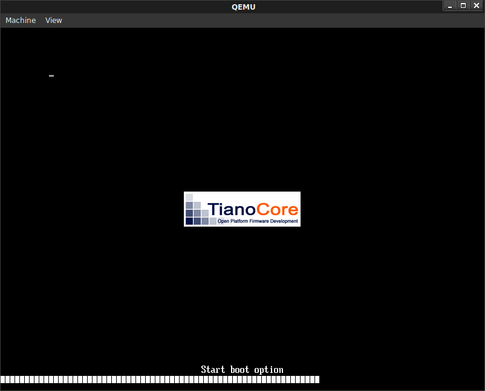
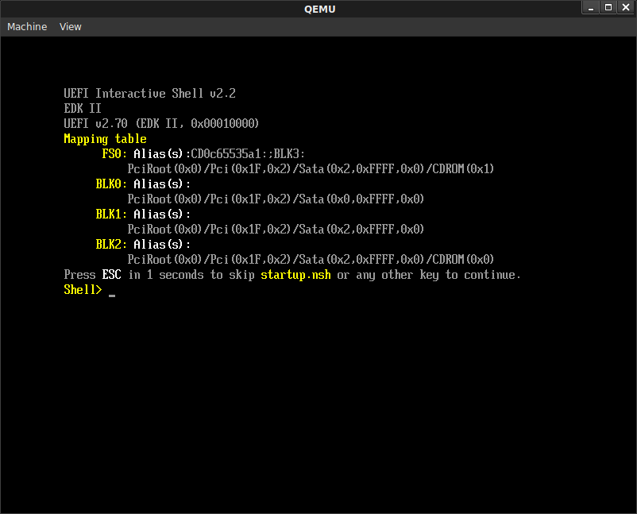
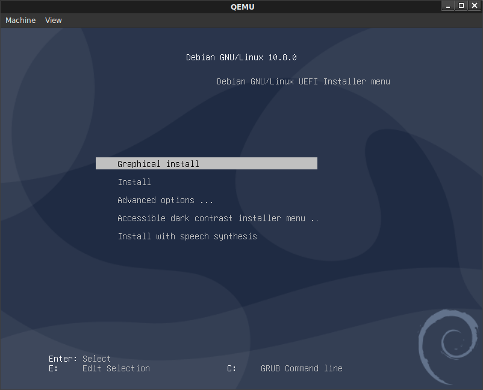
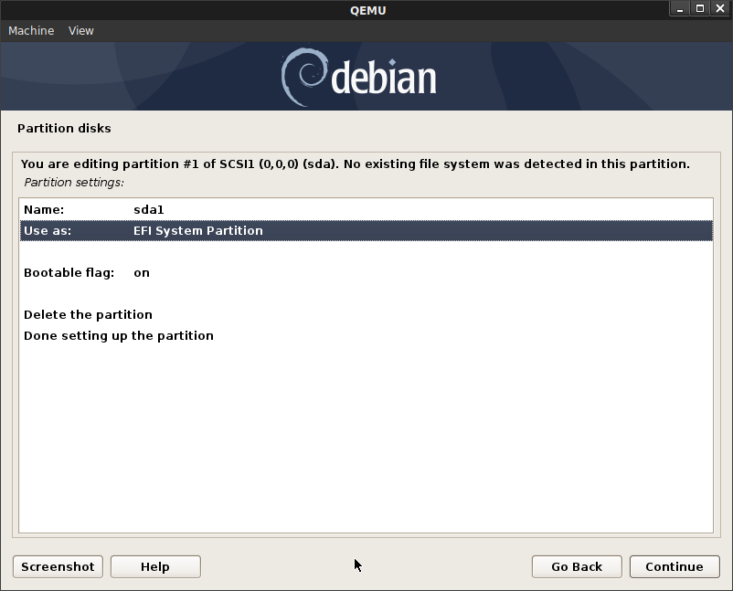
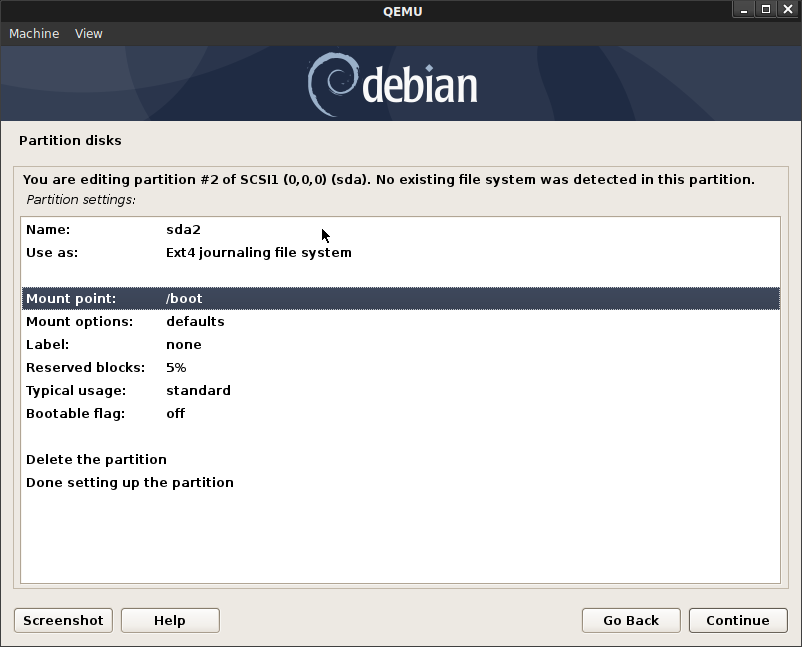
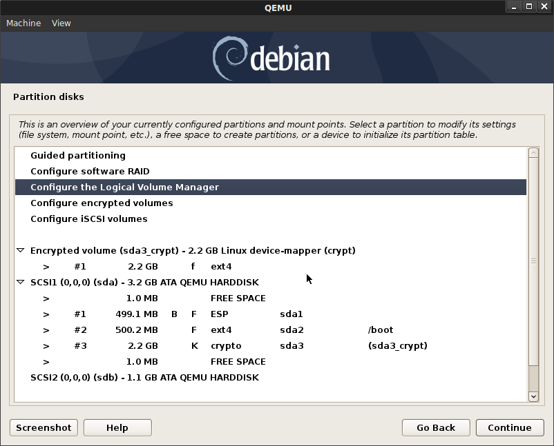
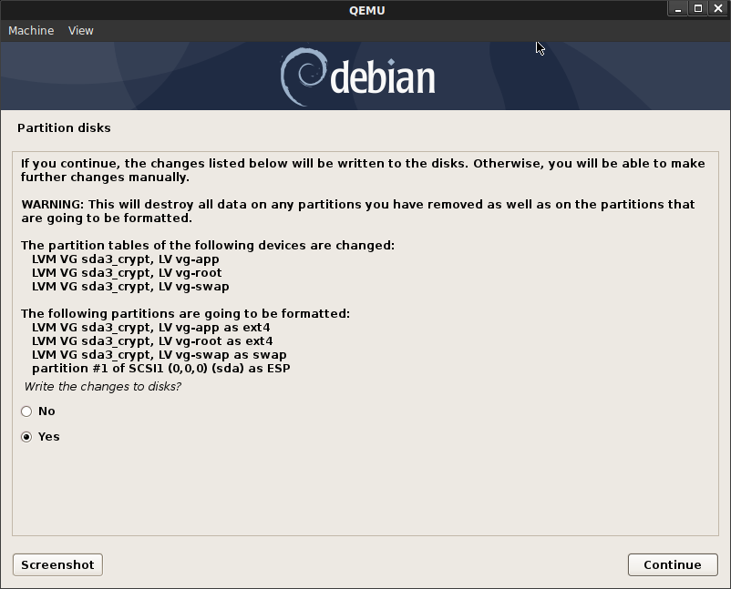
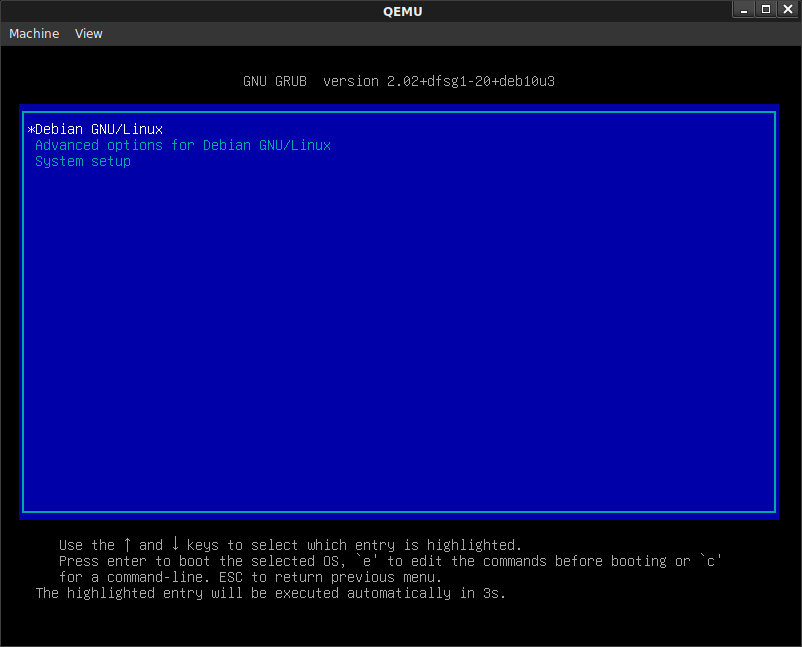
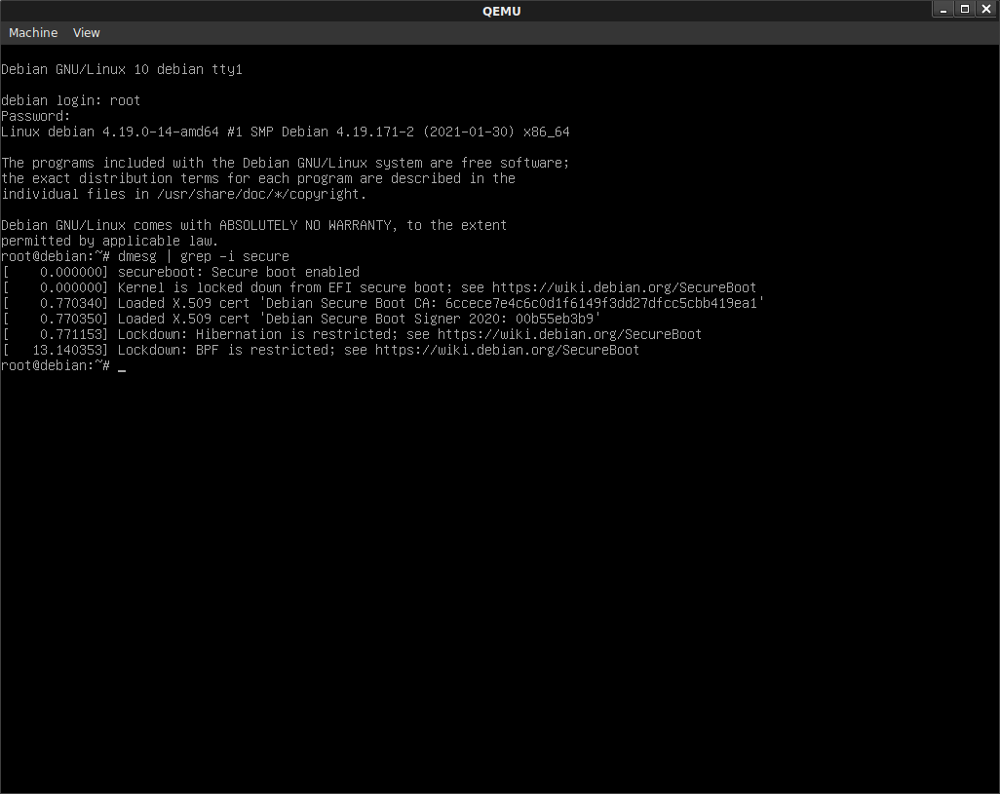

### Testing Secure Boot with qemu and debian 10.8.0

This repo is scratchpad for setting up and testing [SecureBoot VirtualMachine](https://wiki.debian.org/SecureBoot/VirtualMachine) with QEMU.  Its intended to just help get started with secure boot and is primarily just  here to log the steps i took locally.

The secure boot flow here will chain-verify signatures to ensure every step from the Firmware to the kernel is 'verified'.  You can read more about secure boot here:

- [Protecting your system from the scum of the universe](https://elinux.org/images/9/97/Protecting_your_system.pdf)
- [A Reasonably Secure Travel Laptop Setup](https://github.com/CrowdStrike/travel-laptop/blob/master/README.md)
- [Verified Boot](https://www.whonix.org/wiki/Verified_Boot)

This repo also contains some baseline samples of block encryption (`dm-crypt`), file/directory encryption (`fscrypt`) as well as integrity checking for a linux device (`dm-verity`).  

- [dm-crypt](https://en.wikipedia.org/wiki/Dm-crypt)
- [fscrypt](https://www.kernel.org/doc/html/v4.19/filesystems/fscrypt.html)
- [dm-verity](https://www.kernel.org/doc/html/latest/admin-guide/device-mapper/verity.html)


For secure boot, this repo uses the signature and firmware thats already signed using microsoft's root CA that comes with the KVM firmware that we will download (i.e, it uses default Keys for debain standard).  Ultimately, i'll post instruction on how to create your own custom image using your on keys (which in real live hardware would mean you need to flash the firmware of your laptop with these keys...)

Finally, `dm-verity` is just shown standalone...i understand its really useful to verify the OS and 'applications' you run on the VM is in a state that you expect.  I think the kernel can verify the OS entirely using dm-verity but i haven't gotten that far.

I'll be using [KVM qemu](https://www.linux-kvm.org/page/RunningKVM) for this example


#### Get Debian 10.8 and  Firmware

Download [debian-10.8.0-amd64-netinst.iso](https://cdimage.debian.org/debian-cd/current/amd64/iso-cd/)


```bash
mkdir debian_ovmf
cd debian_ovmf/
wget http://http.us.debian.org/debian/pool/main/e/edk2/ovmf_2020.11-2_all.deb
dpkg-deb -xv ovmf_2020.11-2_all.deb .
```

#### Create VM

We will be creating two disks:  `boot.img` and `disk.img`.  The former contains the OS, boot, etc while the disk is used to demonstrate block and dm-verity.

```bash
$ qemu-img create -f qcow2 boot.img 3G 
$ qemu-img create -f qcow2 disk.img 1G 

$ qemu-system-x86_64 -hda boot.img -hdb disk.img -net nic -net user,hostfwd=tcp::10022-:22 -cdrom  debian-10.8.0-amd64-netinst.iso --enable-kvm \
  -m 2048 -boot menu=on -machine q35,smm=on -global driver=cfi.pflash01,property=secure,value=on  \
  -drive if=pflash,format=raw,readonly,file=debian_ovmf/usr/share/OVMF/OVMF_CODE_4M.ms.fd \
  -drive if=pflash,format=raw,file=debian_ovmf/usr/share/OVMF/OVMF_VARS_4M.ms.fd --vga vmware
```

You may need to to specify `-vga vmware` (i did; for some reason the UI would not start)

You should see the splash screen indicating UEFI boot



from there you should see the uefi_screen



type `exit`

You'll then see the boot manager


Select `Boot Manager` then select the `QEMU DVD-ROM`

You should then see the Debian installer.  Select plain graphical installer



Go through the debian installer,  I used the following settings for the partition.

For now, only configure `sda`:

* Manual Partitioning:

* `sda`
  - `sda1` 500MB  ESP System Partition (EFI boot)
  - `sda2` 500MB  Mountpoint `/boot`
  - `sda3`: Logical Volume Group `sda3_crypt`:
     - `vg-root`: 1200MB mount `/`   [root Partition]
     - `vg-swap` 800MB  [swap Partition]
     - `vg-app` 222MB  [swap Partition]


Configure the rest of the disk as an Encrypted Volume (`crypt`), pick any passphrase





Now configure LVM on the encrypted partition on the remaining space on `sda`:

- Create Volume Group: `sda3_crypt`





Ultimately, this is what we're looking to see on the VM

```bash
root@debian:~$ df -kh

Filesystem                       Size  Used Avail Use% Mounted on
  udev                             964M     0  964M   0% /dev
  tmpfs                            196M  2.9M  194M   2% /run
  /dev/mapper/sda3_crypt-vg--root  1.1G  750M  272M  74% /
  tmpfs                            980M     0  980M   0% /dev/shm
  tmpfs                            5.0M     0  5.0M   0% /run/lock
  tmpfs                            980M     0  980M   0% /sys/fs/cgroup
  /dev/sda2                        454M   50M  377M  12% /boot
  /dev/sda1                        476M  5.2M  470M   2% /boot/efi
  /dev/mapper/sda3_crypt-vg--app   202M  1.8M  185M   1% /apps
```

```
root@debian:~$ lsblk -a
  NAME                    MAJ:MIN RM  SIZE RO TYPE MOUNTPOINT
  sda                       8:0    0    3G  0 disk 
  ├─sda1                    8:1    0  476M  0 part /boot/efi
  ├─sda2                    8:2    0  477M  0 part /boot
  └─sda3                    8:3    0  2.1G  0 part 
    ├─sda3_crypt-vg--root 254:0    0  1.1G  0 lvm  /
    ├─sda3_crypt-vg--swap 254:1    0  760M  0 lvm  [SWAP]
    └─sda3_crypt-vg--app  254:2    0  212M  0 lvm  /apps
  sdb                       8:16   0    1G  0 disk 
  sr0                      11:0    1  336M  0 rom
```

Continue the installer (i elected to install only ssh)

Once installation is complete, reboot.  Click `Esc` when you see the Tiano CoreSplash Screen.

Once you save, you should see grub boot screen and then 



Yah!...if you're seeing the grub screen, then we've completed the secure boot sequence!!!

Just type in the crypt password...you'll then suddenly see the 




yesssss!


### SSH to the new VM

By default SSH does not allow root login (you can edit `sshd_config` to change that later).  For now, ssh in with the user you configured during setup
In my case, its `sal@`

```
ssh sal@127.0.0.1 -p 10022
```


```bash
root@debian:~$ dmesg | grep -i secure
[    0.000000] secureboot: Secure boot enabled
[    0.000000] Kernel is locked down from EFI secure boot; see https://wiki.debian.org/SecureBoot
[    0.802175] Loaded X.509 cert 'Debian Secure Boot CA: 6ccece7e4c6c0d1f6149f3dd27dfcc5cbb419ea1'
[    0.802186] Loaded X.509 cert 'Debian Secure Boot Signer 2020: 00b55eb3b9'
[    0.802986] Lockdown: Hibernation is restricted; see https://wiki.debian.org/SecureBoot
[   11.487840] Lockdown: BPF is restricted; see https://wiki.debian.org/SecureBoot
```

---

### DM-Crypt (block encryption)

The following will block encrypt the external, extra drive `/dev/sdb`

```bash
mkdir /mydisk
mkfs.ext4 -O encrypt /dev/sdb

apt-get install cryptsetup
mkdir /mydisk

$ export luks_key=e8e580f16de5d34ba73f66151bd4363a

$ echo  -n $luks_key | cryptsetup luksFormat --type luks1 /dev/sdb -
$ echo  -n $luks_key | cryptsetup luksOpen /dev/sdb my_encrypted_volume -
$ mkfs.ext4 -O encrypt /dev/mapper/my_encrypted_volume

$ lsblk -a
    NAME                    MAJ:MIN RM  SIZE RO TYPE  MOUNTPOINT
    sda                       8:0    0    3G  0 disk  
    ├─sda1                    8:1    0  476M  0 part  /boot/efi
    ├─sda2                    8:2    0  477M  0 part  /boot
    └─sda3                    8:3    0  2.1G  0 part  
      ├─sda3_crypt-vg--root 254:0    0  1.1G  0 lvm   /
      ├─sda3_crypt-vg--swap 254:1    0  760M  0 lvm   [SWAP]
      └─sda3_crypt-vg--app  254:2    0  212M  0 lvm   /apps
    sdb                       8:16   0    1G  0 disk  
    └─my_encrypted_volume   254:3    0 1022M  0 crypt 
    sr0                      11:0    1  336M  0 rom

$ mount /dev/mapper/my_encrypted_volume /mydisk

$ df -kh
    Filesystem                       Size  Used Avail Use% Mounted on
    udev                             964M     0  964M   0% /dev
    tmpfs                            196M  2.9M  194M   2% /run
    /dev/mapper/sda3_crypt-vg--root  1.1G  813M  209M  80% /
    tmpfs                            980M     0  980M   0% /dev/shm
    tmpfs                            5.0M     0  5.0M   0% /run/lock
    tmpfs                            980M     0  980M   0% /sys/fs/cgroup
    /dev/sda2                        454M   50M  377M  12% /boot
    /dev/sda1                        476M  5.2M  470M   2% /boot/efi
    /dev/mapper/sda3_crypt-vg--app   202M  1.8M  185M   1% /apps
    tmpfs                            196M     0  196M   0% /run/user/1000
    /dev/mapper/my_encrypted_volume  990M  2.6M  921M   1% /mydisk

$ umount /mydisk
$ cryptsetup luksClose   /dev/mapper/my_encrypted_volume 
```

### FS-Crypt (file)

The following will use file-level encryption [fscrypt](https://github.com/google/fscrypt) on `/dev/sdb`


- Setup
```bash
apt-get install fscrypt

mkdir /apps
fscrypt setup 
mkfs.ext4  /dev/sdb
mount -t auto /dev/sdb /apps
fscrypt setup /apps
```

- Check status
```bash
$ fscrypt status

  filesystems supporting encryption: 0
  filesystems with fscrypt metadata: 1

  MOUNTPOINT  DEVICE     FILESYSTEM  ENCRYPTION     FSCRYPT
  /           /dev/dm-1  ext4        not enabled    No
  /apps       /dev/sdb   ext4        supported      Yes
  /boot       /dev/sda2  ext2        not enabled    No
  /boot/efi   /dev/sda1  vfat        not supported  No
```

- Create encrypted mount
  Pick option (2), pick any passphrase for the protector
```bash
$ mkdir /apps/encrypted
$ fscrypt encrypt /apps/encrypted --user=root

$ fscrypt encrypt /apps/encrypted --user=root
  Your data can be protected with one of the following sources:
  1 - Your login passphrase (pam_passphrase)
  2 - A custom passphrase (custom_passphrase)
  3 - A raw 256-bit key (raw_key)
  Enter the source number for the new protector [2 - custom_passphrase]: 2
  Enter a name for the new protector: protector1
  Enter custom passphrase for protector "protector1": 
  Confirm passphrase: 
  "/apps/encrypted" is now encrypted, unlocked, and ready for use.
```

- Write auto encrypted

  Check that you can write to the file as usual

```bash
$ echo foobar > /apps/encrypted/a.txt

$ more /apps/encrypted/a.txt 
foobar

$ ls /apps/encrypted/
a.txt
```

- Disable encryption

  See that the file is no encrypted

```bash
$ fscrypt purge /apps --user=root
  WARNING: Encrypted data on this filesystem will be inaccessible until unlocked again!!
  Purge all policy keys from "/apps" and drop global inode cache? [y/N] y
  Policies purged for "/apps".
  Encrypted data removed filesystem cache.

$ ls /apps/encrypted/
FwBd84Ip7XcJLcORkErshY2q1MCDs3hQd8VTx0kmMvM

$ fscrypt unlock /apps/encrypted --user=root
  Enter custom passphrase for protector "protector1": 
  "/apps/encrypted" is now unlocked and ready for use.

root@debian:/apps# ls /apps/encrypted/
a.txt
```

### DM-Verity

The following will setup [dm-verity](https://www.kernel.org/doc/html/latest/admin-guide/device-mapper/verity.html) integrity checking on `/dev/sdb`.  Once you finish writing to the mount, unmunt it, use dm-verity to calculate its expected hash and the remount it only if the hash matches using dm-verity

- Mount disk and write a file to it
```bash
umount /apps
mkfs.ext4  /dev/sdb

mount /dev/sdb /apps
echo foo > /apps/file.txt
umount /apps
```

- Setup dm-verity 

  Acquire the root hash for the device 

```bash
$ veritysetup format /dev/sdb sig.img
    VERITY header information for sig.img
    UUID:            	4709d5bc-02b1-45ce-adf2-bf37ff994111
    Hash type:       	1
    Data blocks:     	262144
    Data block size: 	4096
    Hash block size: 	4096
    Hash algorithm:  	sha256
    Salt:            	e896157bca7886deedf3ef28421161e78a09ccd9a84397ecb38e31d205883efd
    Root hash:      	1be65086d43cdcedd9019f6ca94ac68d99ea07abb2a67bac9a312aff9359fa3e

$ veritysetup create vroot /dev/sdb sig.img 1be65086d43cdcedd9019f6ca94ac68d99ea07abb2a67bac9a312aff9359fa3e


$ lsblk -a
    NAME                    MAJ:MIN RM  SIZE RO TYPE  MOUNTPOINT
    loop0                     7:0    0  8.1M  0 loop  
    └─vroot                 254:3    0    1G  1 crypt 
    loop1                     7:1    0        0 loop  
    loop2                     7:2    0        0 loop  
    loop3                     7:3    0        0 loop  
    loop4                     7:4    0        0 loop  
    loop5                     7:5    0        0 loop  
    loop6                     7:6    0        0 loop  
    loop7                     7:7    0        0 loop  
    sda                       8:0    0    3G  0 disk  
    ├─sda1                    8:1    0  476M  0 part  /boot/efi
    ├─sda2                    8:2    0  477M  0 part  /boot
    └─sda3                    8:3    0  2.1G  0 part  
      ├─sda3_crypt-vg--root 254:0    0  1.1G  0 lvm   /
      ├─sda3_crypt-vg--swap 254:1    0  760M  0 lvm   [SWAP]
      └─sda3_crypt-vg--app  254:2    0  212M  0 lvm   
    sdb                       8:16   0    1G  0 disk  
    └─vroot                 254:3    0    1G  1 crypt 
    sr0                      11:0    1  336M  0 romrom
``` 

Now mount the `vroot` verity protected device `/dev/mapper/vroot` 

```bash
$ mount -t auto /dev/mapper/vroot  /apps

$ cat /apps/file.txt 
foo

$ veritysetup status /dev/mapper/vroot
    type:        VERITY
    status:      verified
    hash type:   1
    data block:  4096
    hash block:  4096
    hash name:   sha256
    salt:        e896157bca7886deedf3ef28421161e78a09ccd9a84397ecb38e31d205883efd
    data device: /dev/sdb
    size:        2097152 sectors
    mode:        readonly
    hash device: /dev/loop0
    hash loop:   /root/sig.img
    hash offset: 8 sectors
```

Now check if the device disk matches the expected hash value

```
$ veritysetup verify /dev/sdb /dev/loop0 1be65086d43cdcedd9019f6ca94ac68d99ea07abb2a67bac9a312aff9359fa3e 
```

If there is a mismatch in the hash values, you will see an error:

```bash

$ umount /apps
$ veritysetup remove vroot

$ mount /dev/sdb /apps
$ echo foobar > /apps/file.txt
$ umount /apps

$ veritysetup verify /dev/sdb /dev/loop0 1be65086d43cdcedd9019f6ca94ac68d99ea07abb2a67bac9a312aff9359fa3e 
  Verity device detected corruption after activation.
```
---

### References

- [Take Control of Your PC with UEFI Secure Boot](https://www.linuxjournal.com/content/take-control-your-pc-uefi-secure-boot)
- [Debian 10 (“Buster”) Secure Boot Installation and Troubleshooting (2019–07–07)](https://medium.com/@kyleomalley/debian-10-buster-secure-boot-install-and-troubleshooting-2019-07-07-ae6f3b24218b)
- [Managing EFI Boot Loaders for Linux: Controlling Secure Boot](https://www.rodsbooks.com/efi-bootloaders/controlling-sb.html#creatingkeys)

